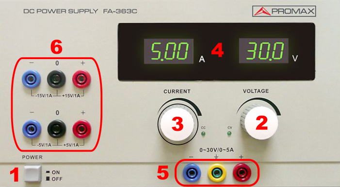

# Fuente FA363C

La **fuente de alimentación Proxmax FA363C** permite suministrar **voltaje y corriente regulables** para circuitos electrónicos. Además dsipone de dos fuentes independientes con salida de volaje simetricas fijas, una de +-15V y otra de +-5V, para alimentar circuitos con alimentación simétrica. Esta guía explica cómo usarla de manera segura y efectiva.

## 1. Componentes principales

- **Pantalla digital:** muestra voltaje y corriente de salida.  
- **Mandos de ajuste:**  
    - **Voltaje:** regula la tensión de salida.  
    - **Corriente:** limita la corriente máxima suministrada.  
- **Interruptor de encendido/apagado:** controla la alimentación principal.  
- **Terminales de salida regulable (0-30V/0-5A)**  
    - **Rojo:** positivo (+)  
    - **Azul:** negativo (-)  
    - **Amarillo:** tierra distribución.
- **Terminales de salidas fijas (-15V +15V o +5V -5V)**  
    - **Rojo:** positivo (+15V o +5V)  
    - **Azul:** negativo (-15V o -5V)  
    - **Negro:** gnd  

!!! warning "**Precaución:** El conector amarillo es la tierra de distribución del edificio, no la de nuestro circuito"

## 2. Ajuste de parámetros
  

### 2.1 Salida regulable (0-30V/0-5A)
1. Enciende la fuente con el interruptor principal **[1]**.  
2. Ajusta el **voltaje** al valor deseado usando el mando  **[2]**.  
3. Ajusta el **límite de corriente** según las necesidades del circuito, con el mando **[3]**.
4. Observa en la pantalla que los valores se estabilicen antes de conectar la carga.  

### 2.2 Salidas fijas (+15V -15V o +5V -5V)
1. Enciende la fuente con el interruptor principal  **[1]**.  
!!! info "Estas salidas son fijas con lo que no pueden ser reguladas por los mandos anteriores."

## 3. Conexión al circuito

### 3.1 Fuente regulable
1. Conecta el terminal **rojo** de la salida **[5]** al punto positivo del circuito.  
2. Conecta el terminal **azul** de la salida **[5]** al punto negativo del circuito. 
3. Usa cables adecuados.(Están en un soporte en la pared del laboratorio).  
4. Asegúrate de que las conexiones sean firmes y seguras.  

### 3.2 Fuentes fijas
1. Conecta el terminal **rojo** de la salida **[6]** al punto positivo del circuito.  
2. Conecta el terminal **azul** de la salida **[6]** al punto negativo del circuito.
3. Conecta el terminal **negro** de la salida **[6]** al GND del circuito.  
3. Usa cables adecuados.(Están en un soporte en la pared del laboratorio).   
5. Asegúrate de que las conexiones sean firmes y seguras.

## ⚠️ Consejos de seguridad

- Nunca excedas la tensión o corriente máxima de la fuente.  
- Intenta respetar los colores de los cables con los de los conectores, esto facilitará su identificación en todo su recorrido hasta nuestro circuito.
- Comprueba siempre la polaridad antes de conectar el circuito.  
  
!!! danger "**Desconecta** siempre la fuente, antes de modificar el circuito, o cambiar conexiones."