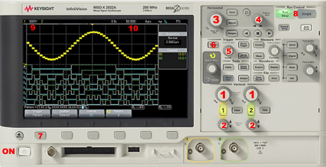

# Osciloscopio MSOX2002A

El **osciloscopio MSOX2002A** es un instrumento de medición que permite visualizar **señales eléctricas en el tiempo**, mostrando su forma de onda, amplitud y frecuencia. Esta guía explica cómo conectarlo y usarlo de manera segura y efectiva.

## 1. Componentes principales

- **Pantalla:** muestra la señal medida y la cuadrícula de referencia.  
- **Controles verticales [1] [2]:** ajustan la escala de voltaje y posición vertical de la señal.  
- **Controles horizontales [3] [4]:** ajustan la escala de tiempo y posición horizontal de la señal.  
- **Controles de disparo (trigger) [5] [6]:** estabilizan la señal en pantalla.  
- **Terminales de entrada (canales):**
  - **CH1, CH2:** entradas para sondas.  
- **Sonda de medición:** punta que se conecta al circuito y ajusta la atenuación (1x, 10x).  

## 2. Conexión de las sondas

1. Conecta la **punta de la sonda** al canal deseado (CH1 o CH2).  
2. Conecta la **pinza de tierra** de la sonda al punto de referencia del circuito (masa).  
3. Ajusta el selector de atenuación de la sonda (1x o 10x) según la señal y la entrada del osciloscopio.  
4. Comprueba que las sondas y cables no estén dañados.

## 3. Ajuste de los controles

### 3.1 Ajuste vertical

- **Volts/div:** escala de voltaje por división de cada canal **[1]**.  
- **Posición:** desplaza la señal del canal hacia arriba o abajo en la pantalla **[2]**.

### 3.2 Ajuste horizontal

- **Time/div:** escala de tiempo por división **[3]**.  
- **Posición:** desplaza la señal hacia la izquierda o derecha **[4]**.  

### 3.3 Ajuste de disparo (trigger)

- **Nivel:** define el voltaje en el que la señal se estabiliza en pantalla **[5]**.  
- **Menu disparo:** **[6]**.
      - **Fuente:** selecciona el canal a usar para el disparo **[7]**.  
      - **Modo:** auto o único, según necesites visualizar señales periódicas o irregulares **[8]**.

## 4. Medición paso a paso

### 4.1 Visualizar una señal

1. Conecta la sonda al circuito y al canal del osciloscopio.  
2. Encender el osciloscopio con **[ON]**.
3. Ajusta **Volts/div**  **[1]** y **Time/div**  **[3]** hasta que la señal sea visible y clara.  
4. Ajusta la **posición vertical [2]** y horizontal **[4]** para centrar la señal.  

### 4.2 Estabilizar la señal

1. Selecciona el canal de diparo pulsando **[6]** y en **trigger source** **[7]**.  
2. Ajusta el **nivel de disparo** **[5]** hasta que la señal se mantenga estable en pantalla.  
3. Usa el **modo run** **[8]** para señales continuas o **single** para señales intermitentes **stop** para congelar la señal en la pantalla.  

### 4.3 Medir parámetros de la señal

- **Amplitud:** cuenta las divisiones verticales y multiplica por **Volts/div** **[9]**.  
- **Periodo:** cuenta las divisiones horizontales y multiplica por **Time/div** **[10]**.  
- **Frecuencia:** 1 / período.  

## ⚠️ Consejos de seguridad

- Nunca conectes la sonda a un circuito cuya tensión supere la capacidad del osciloscopio.  
- Asegúrate de conectar la pinza de tierra al punto de referencia adecuado.  
- No toques las puntas metálicas con las manos mientras mides.  
- Apaga el osciloscopio después de usarlo para prolongar su vida útil.  
