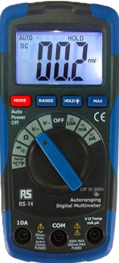

# Polimetro RS14

El **polímetro RS14** es un instrumento de medición de parámetros eléctricos como **tensión, corriente y resistencia**. Esta guía explica cómo conectarlo y usarlo de manera segura y efectiva.

## 1. Componentes principales

- **Pantalla LCD:** muestra los valores medidos y unidades. 
- **Selector de función:** rueda giratoria para elegir el modo de medición (V, A, Ω, continuidad, etc.).  
- **Terminales de entrada:**
  - **COM (negativo):** para la punta negra.  
  - **V/Ω/mA (positivo):** para medir tensión, resistencia o corriente pequeña.  
  - **10A (positivo):** para medir corriente hasta 10 A.  
- **Puntas de prueba:** roja (positiva) y negra (negativa).  

## 2. Conexión de las puntas

1. Inserta la punta **negra** en **COM**.  
2. Inserta la punta **roja** en el terminal según lo que vayas a medir:  
   - Para **tensión, resistencia o corriente pequeña**, en **V/Ω/mA**.  
   - Para **corriente alta (hasta 10 A)**, en **10A**.  
3. Comprueba que las puntas no estén dañadas y que las manos no toquen las puntas metálicas durante la medición.

## 3. Ajuste del modo de medición

Gira la rueda del selector a la función que necesitas:  

| Función | Símbolo | Uso |
|---------|---------|-----|
| Tensión continua | V⎓ | Medir voltaje de baterías o circuitos DC |
| Tensión alterna | V~ | Medir voltaje de corriente AC |
| Corriente continua | 10A⎓ o mA o uA | Medir corriente DC |
| Corriente alterna | 10A~ o mA o uA| Medir corriente AC |
| Resistencia | Ω | Medir resistencia de resistencias o cables |
| Continuidad |  → + mode | Comprobar si un circuito está cerrado |
| Diodo | →|  Comprobar polaridad y caída de tensión en diodos |

## 4. Medición paso a paso

### 4.1 Medir tensión

1. Coloca el selector en **V⎓** o **V~** según corresponda.  
2. Conecta las puntas en paralelo al componente o circuito.  
3. Lee el valor en la pantalla.  

### 4.2 Medir corriente

!!!info "Por seguridad si no conocemos el valor que vamos a medir es mejor comenzar midiendo en la escala de 10 A y luego pasar a la de 200 ma cuando hemos comprobado que es menor a ese valor."

1. Coloca el selector en **A⎓** o **mA** o **uA**.
2. Con el botón **mode** cambiamos entre  **Coriente Alterna (~AC)** o **Corriente Continua (⎓DC)**.
3. Para corrientes > 200 ma y < 10 A usa el terminal **10A**.
4. Conecta las puntas **en serie** con el circuito.  
5. Lee el valor en la pantalla.   

!!!danger "Nuncas conectes las puntas en paralelo con el circuito a medir, ya que fundiría el fusible interior."

### 4.3 Medir resistencia

1. Coloca el selector en **Ω**.  
2. Asegúrate de que el circuito esté **desconectado de la alimentación**.  
3. Conecta las puntas al componente.  
4. Lee la resistencia en la pantalla.  

### 4.4 Comprobación de continuidad

1. Coloca el selector en **→**.  
2. Pulsa el botón **mode**.
3. Conecta las puntas a ambos extremos del circuito.  
4. Si hay continuidad, el polimetro emitirá un pitido.  

### 4.5 Comprobación de diodos

1. Prueba en polarización directa:

       - Conecta la punta positiva (roja) al terminal opuesto a la raya del diodo (ánodo).
       - Conecta la punta negativa (negra) al terminal junto a la raya (cátodo).
       - Observa la lectura:
         - Si aparece OL → el diodo está abierto (dañado).
         - Si aparece un valor de tensión (normalmente 0.6–0.7 V para diodos de silicio) → el diodo puede estar bien, seguimos con el siguiente paso.

2. Prueba en polarización inversa:

      - Invierte las puntas del multímetro:
      - Punta positiva al cátodo.
      - Punta negativa al ánodo.
      - Observa la lectura:
        - Si aparece OL → el diodo está correcto.
        - Si aparece un valor de tensión → el diodo está defectuoso.

## ⚠️ Consejos de seguridad

- Nunca midas corriente en paralelo, solo en serie. 
- Para medir un componente este debe estar fuera del circuito. 
- Evita tocar las puntas metálicas con las manos mientras realizas mediciones.  
- Asegúrate de que el rango del polimetro sea superior al valor esperado a medir.  
- Apaga el polimetro después de usarlo para conservar la batería. 